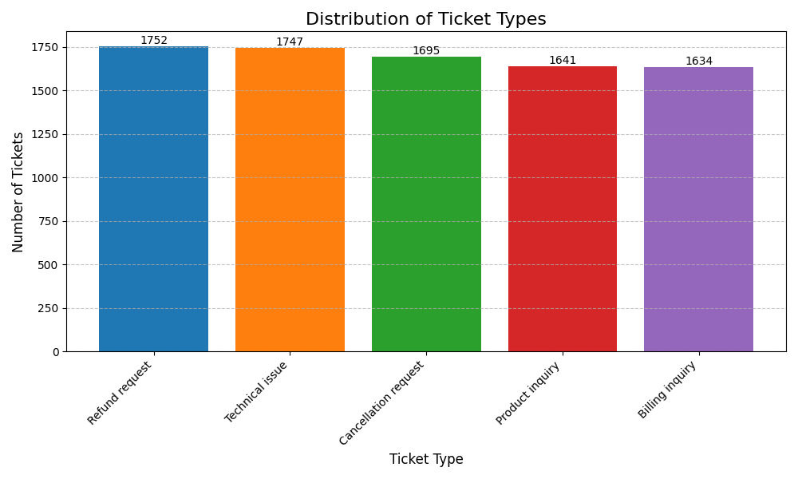
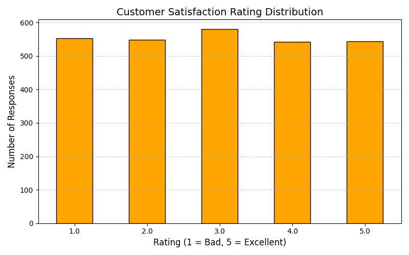

# FUTURE_ML_03 - Customer Support Chatbot System

## Project Overview
This project is part of the **Future ML** program and focuses on building an intelligent customer support solution.  
It leverages **Natural Language Processing (NLP)** techniques to develop a chatbot capable of handling customer inquiries in real-time, with contextual understanding and automated assistance.

Technologies used include **Python**, **Flask**, **Pandas**, **Matplotlib**, and custom pattern-matching algorithms.

---

## Chatbot Interface

### 🤖 Interactive Chat Experience
Explore our intuitive customer support chatbot interface:

<table>
  <tr>
    <td></td>
    <td></td>
    <td></td>
  </tr>
</table>

### 📱 Demo Video
Watch the chatbot in action:  


https://github.com/user-attachments/assets/63ca7904-5f01-43de-abbe-340c04bdf4fa


---

## Capabilities

### 🧠 Intelligent Response Mechanism
The chatbot leverages rule-based logic and NLP techniques to deliver accurate, context-aware responses:
- **Exact Match Detection** – Recognizes predefined queries with precision.  
- **Token-Level Analysis** – Breaks down and interprets complex user inputs.  
- **Keyword Extraction** – Identifies and responds based on key terms.  
- **Weighted Scoring Logic** – Prioritizes critical keywords for better intent recognition.  
- **Fallback Strategy** – Provides helpful responses for unrecognized inputs.  

### 💬 Seamless Conversational Flow
Designed to simulate human-like interactions with attention to detail:
- Simulated typing indicators  
- Dynamic response delays  
- Visual interaction cues  
- Maintains context across multi-turn conversations  
- Suggests relevant follow-up questions  

### 🔍 Core Support Features
Covers a wide range of frequently asked customer service topics:
- Order tracking and status updates  
- Shipping options and delivery timelines  
- Return and refund procedures  
- Product specifications and availability  
- Payment method assistance  
- Store locations and operating hours  
- Discount and promotional information  

---

## 🧰 Tools & Libraries

The project utilizes a modern tech stack for building, analyzing, and visualizing the chatbot system:

- **🐍 Python** – Core language powering the backend logic and chatbot functionality  
- **🌐 Flask** – Lightweight web framework used to serve the chatbot interface  
- **🖥️ HTML5 / CSS3 / JavaScript** – Responsive and user-friendly frontend design  
- **📊 Pandas** – Data handling and transformation  
- **📈 Matplotlib** – Visualizations for support analytics  
- **📒 Jupyter Notebook** – Exploratory data analysis and prototyping  

---

## Dataset 
- **Source**: Customer Support Ticket Dataset 📂  
- **Location**: `/data/intents.json` 📁  
- **Contents**: Intent tags, pattern recognition strings, and response templates 🧩  
- **Kaggle Dataset**: [Customer Support Ticket Dataset](https://www.kaggle.com/datasets/waseemalastal/customer-support-ticket-dataset) 🔗  

---

## Support Analytics

### 📊 Ticket Type Distribution


### 📈 Customer Satisfaction Analysis


---

## Folder Structure

```
FUTURE_ML_03/
│
├── analysis/
│   ├── images/
│   │   ├── customer_satisfaction_distribution.png
│   │   ├── query_distribution.png
│   ├── customer_support_tickets.csv
│   └── visualization.ipynb
│
├── data/
│   └── intents.json
│
├── templates/
│   └── index.html
│
├── ui/
│   ├── cscb.mp4
│   ├── ui0.png
│   ├── ui1.png
│   └── ui2.png
│
├── chatbot.py
├── README.md
└── requirements.txt
```

---

## How to Run

1. Clone the repository:
   ```bash
   git clone https://github.com/yourusername/FUTURE_ML_03.git
   ```

2. Install the dependencies:
   ```bash
   pip install -r requirements.txt
   ```

3. ⚠️ Recommended Python version:
    ```bash
    This project was developed and tested using Python 3.9.0.
    Using the same version is recommended for compatibility.
    ```

4. Run the application:
   ```bash
   python chatbot.py
   ```

5. Open your browser and navigate to:
   ```
   http://127.0.0.1:5000/
   ```

---

## Customization

### Adding New Intents
Update the `intents.json` file to add new conversation patterns:

```json
{
  "tag": "new_intent",
  "patterns": [
    "Your new pattern 1",
    "Your new pattern 2"
  ],
  "responses": [
    "Your new response 1",
    "Your new response 2"
  ]
}
```

### Modifying the UI
The frontend interface can be customized by editing the files in the `templates/` directory.

---

## Future Improvements
- Integration with machine learning models
- User authentication system
- Multi-language support
- Backend CRM integration
- Voice recognition capabilities
- Sentiment analysis for customer responses

---

## Author
- [Adnan Rahman Sayeem]
- Connect with me on [LinkedIn](https://www.linkedin.com/in/adnan-rahman-sayeem/)

---

## Acknowledgements
- Grateful to the **Flask** open-source community for providing a robust and lightweight web development framework.
- Special thanks to the creators of supporting libraries and tools that made this project possible, including **Pandas**, **Matplotlib**, and **Jupyter Notebook**.
- This project was developed as part of the **Future ML** program, aimed at fostering hands-on machine learning experience.
